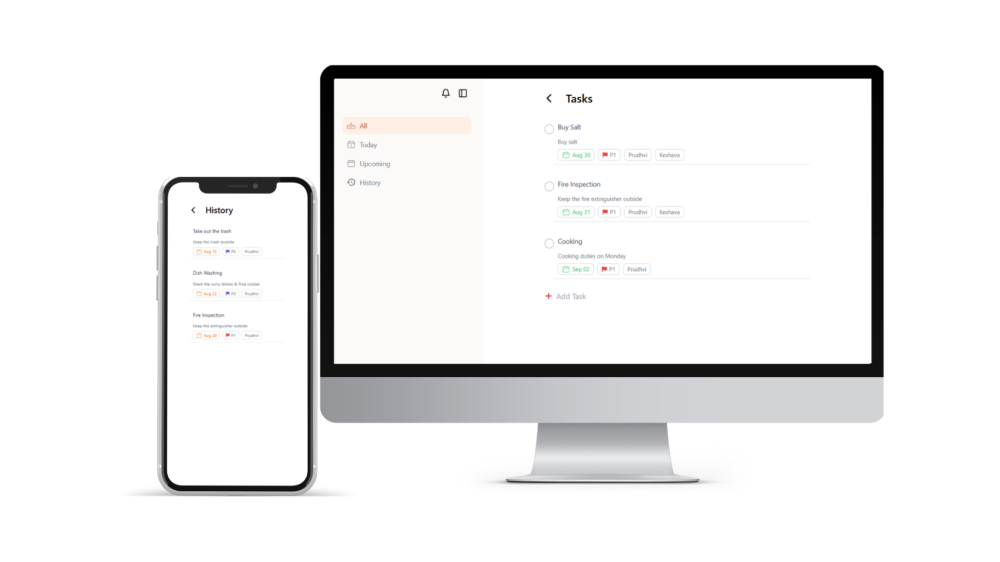
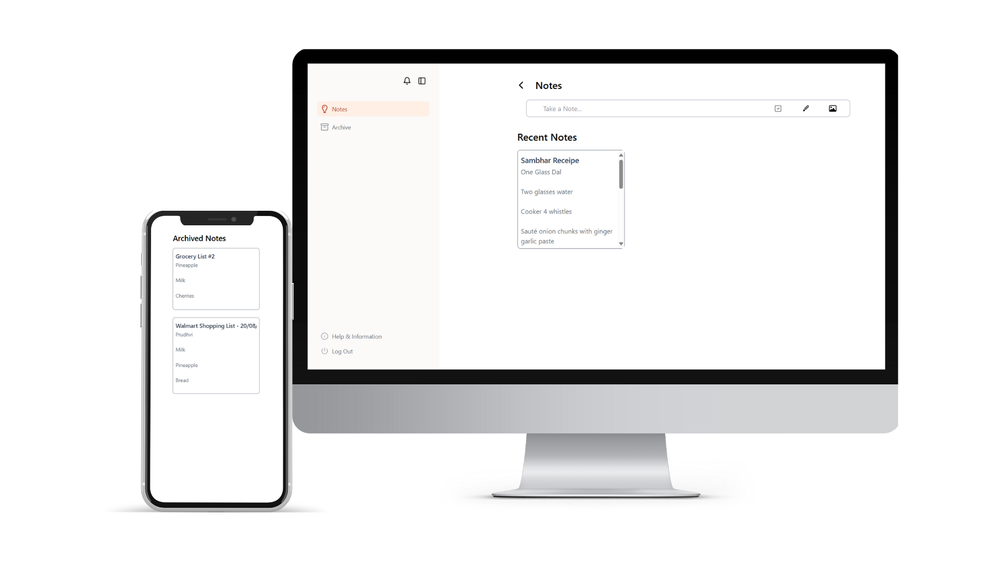
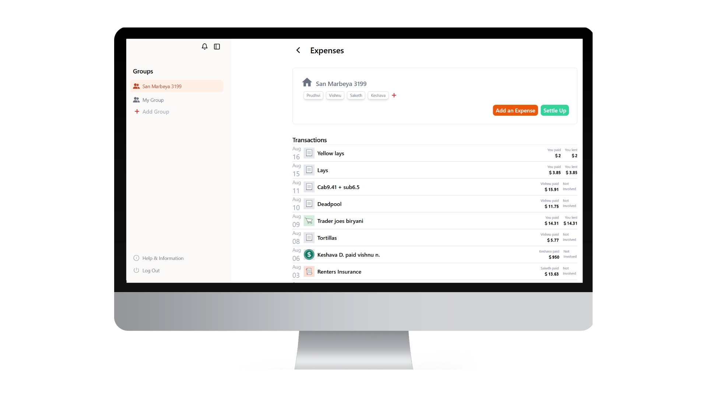

# Ease Abode

Ease-Abode is a collaborative app designed to streamline living in shared spaces, like apartments, by making it easier to manage and share everyday tasks. The goal is to reduce unnecessary confrontation, avoid procrastination, and keep the living space clean and organized.


**Try it** ----> https://main.dnps4nuz4t58p.amplifyapp.com/

### Built with

[](https://skillicons.dev)

# Features

## Task Management

Easily list household tasks (like cooking, cleaning, etc.) and assign them to specific members of the household. This helps ensure that everyone knows their responsibilities and that tasks are evenly distributed.



## Notes

A convenient notes feature allows housemates to share important information, such as recipes, grocery lists, or any other notes that can be referred to by everyone.



## Expense Management

A Splitwise-like expense management system that allows users to keep track of shared expenses. The dashboard provides a summary of various activities, expenses, and tasks, making it easy to stay on top of everything.



# Getting Started

To get started with Ease-Abode, follow the instructions below:

1. **Clone the repository:**

```
 git clone https://github.com/yourusername/ease-abode.git
```

2. **Navigate to the project directory:**

```
 cd ease-abode
```

3. **Install dependencies:**

```
npm install
```

4. **Run the application:**

```
 npm start
```
